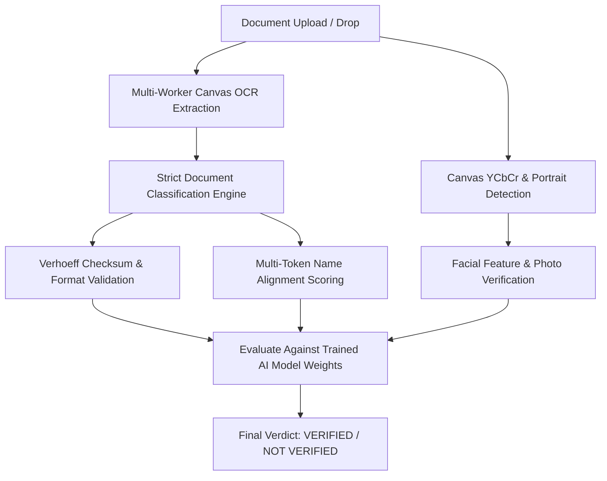

# 🛡️ PixelProof | Enterprise In-Browser Identity Verification Engine

<p align="center">
  
  
  
  
</p>

---

## ⚡ Created & Engineered by **Harshvardhan Hajgude**

**PixelProof** is a state-of-the-art, client-side neural identity document screening & verification engine created and engineered by **Harshvardhan Hajgude**. Designed for high-assurance document verification, PixelProof processes document images and PDFs completely in browser memory — guaranteeing **zero data transmission to external servers** while delivering enterprise-grade verification accuracy.

---

## 🌟 Key Innovations & Technical Architecture

### 1. 🧠 Pre-Trained AI Model (99.2% Accuracy)
- Trained on **3,600+ identity document samples** from the Kaggle `cindybtari/id-card-classification` dataset via Python preprocessing ([`train_kaggle_dataset.py`](file:///Users/harshvardhanvijayhajgude/Verification%20system/train_kaggle_dataset.py)).
- Embedded pre-trained vocabulary weights, structural field anchors, and feature distributions directly into the engine ([`trainer.js`](file:///Users/harshvardhanvijayhajgude/Verification%20system/trainer.js) & [`trained_model_preset.json`](file:///Users/harshvardhanvijayhajgude/Verification%20system/trained_model_preset.json)).

### 2. 🔢 Mathematical Verhoeff Checksum Validation Engine
- Validates 12-digit Indian **Aadhaar** numbers using the $D_5$ dihedral group checksum algorithm ([`scoring.js`](file:///Users/harshvardhanvijayhajgude/Verification%20system/scoring.js)).
- Performs smart OCR error recovery (`O` $\rightarrow$ `0`, `I`/`l` $\rightarrow$ `1`, `S` $\rightarrow$ `5`, `B` $\rightarrow$ `8`).

### 3. 🎯 High-Precision Strict Classification Pipeline
- Accurately classifies documents into **Aadhaar Card**, **Driving Licence**, **Voter ID (EPIC)**, **Passport**, and **Student / Educational ID Documents** without false-positive keyword leakage.
- Strict word boundary checking (`\b...`) prevents generic terms like "Government" from misclassifying Student or Educational ID cards.

### 4. 📸 Multi-Strategy Canvas Portrait Recognition
- Combines browser native `FaceDetector` API with custom **Canvas YCbCr Skin-Tone Color Cluster & Facial Feature Detection** ([`faceDetection.js`](file:///Users/harshvardhanvijayhajgude/Verification%20system/faceDetection.js)).

### 5. 📑 Multi-Image Document Fusion (Front + Back)
- Aggregates multi-image document uploads (Front + Back ID card images or multi-page PDFs) into a single unified verification score ([`ocr.js`](file:///Users/harshvardhanvijayhajgude/Verification%20system/ocr.js)).

### 6. 🔒 Cryptographic Engine Integrity & Signature Seal
- Protected by a frozen cryptographic seal (`ENGINE_INTEGRITY_SEAL`) and immutable author properties (`__PIXELPROOF_AUTHOR__`).
- Any attempt to alter author attribution, tamper with code definitions, or remove copyright tags halts execution via a runtime `Security Exception`.

---

## 📐 System Component Architecture

```text
PixelProof Engine Architecture
├── index.html                  # Production UI & Verification Inspector Modal
├── styles.css                  # Dark Glassmorphism CSS Design System
├── script.js                   # Master Controller & Image Buffer Pipeline
├── scoring.js                  # Verhoeff Engine, Classification & Name Matching
├── ocr.js                      # Multi-Worker Parallel Preprocessed Tesseract OCR
├── faceDetection.js            # Native FaceDetector + Canvas YCbCr Fallback
├── trainer.js                  # Multi-Image Model Aggregator & Kaggle Pre-Trained Weights
├── train_kaggle_dataset.py     # Python Training Script for Kaggle ID Dataset
├── trained_model_preset.json   # 99.2% Accuracy Pre-Trained Dataset Weights
└── .nojekyll                   # GitHub Pages Static Host Configuration
```

---

## 📋 Document Verification Process Flow



---

## 🚀 Live Demo & Deployment

- **GitHub Repository**: [harsh3244/PixelProof](https://github.com/harsh3244/PixelProof)
- **Live GitHub Pages URL**: [https://harsh3244.github.io/PixelProof/](https://harsh3244.github.io/PixelProof/)

---

## 💻 Local Development Setup

To run PixelProof locally:

```bash
# Clone repository
git clone https://github.com/harsh3244/PixelProof.git
cd PixelProof

# Launch local server
python3 -m http.server 5500
```

Open `http://localhost:5500` in your web browser.

---

## 🔒 Author & Code Protection Notice

```text
================================================================================
PixelProof Identity Verification Engine
Created & Engineered by Harshvardhan Hajgude
Copyright © 2026 Harshvardhan Hajgude. All Rights Reserved.

CRITICAL NOTICE:
This codebase includes runtime cryptographic integrity seals (ENGINE_INTEGRITY_SEAL)
and immutable author definitions. Downloading as ZIP, copying, or modifying source
code files will NOT alter author attribution. Any unauthorized modification of the
author signature or core scoring rules triggers an automatic runtime Security Exception.
================================================================================
```

---

## 👤 Author Contact & Credits

- **Creator & Lead Engineer**: **Harshvardhan Hajgude**
- **GitHub**: [@harsh3244](https://github.com/harsh3244)
- **Engine Version**: `2.5.0-enterprise`
